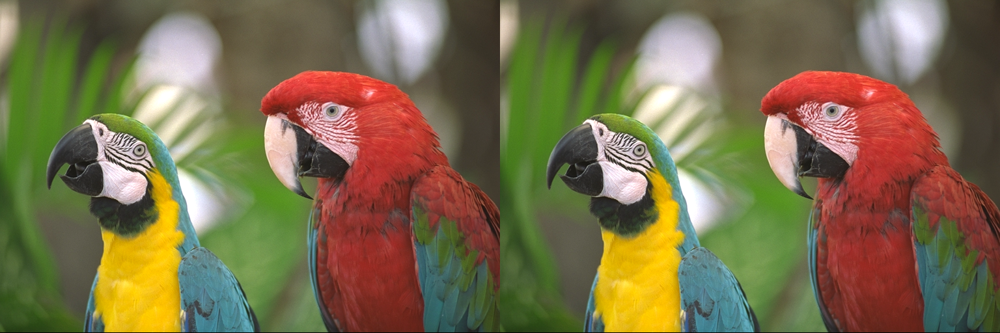
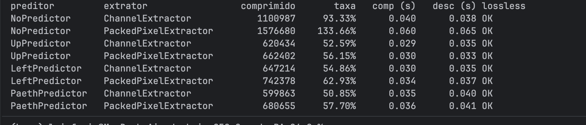

# Greed_Compressor-Huffman

**Número da Lista**: 58<br>
**Conteúdo da Disciplina**: Algoritmos Ambiciosos<br>
**Nome da aplicação**: huff, compressor de imagens sem perdas<br>
**Status**: implementado em C++17, com programa de linha de comando e suíte de testes automáticos.

## Alunos

| Matrícula | Aluno                                |
|:----------|:-------------------------------------|
| 231011696 | Luiz Guilherme Morais da Costa Faria |

## Sobre

O `huff` comprime imagens PPM (formato `P6`, 8 bits por canal) sem perdas: a imagem descomprimida é idêntica, byte a byte, à original. A compressão acontece em três etapas: um preditor transforma cada pixel na diferença para um vizinho, um extrator separa o resultado em fluxos de símbolos e a codificação de Huffman grava cada fluxo com códigos mais curtos para os símbolos mais frequentes.

O foco acadêmico é a codificação de Huffman, um algoritmo ambicioso clássico. Ele monta a árvore de códigos juntando sempre os dois nós de menor frequência, e essa escolha local produz um código de prefixo ótimo. O programa também compara quatro preditores e dois extratores, o que dá oito combinações para medir qual comprime melhor cada tipo de imagem.

## Instalação

**Linguagem**: C++17<br>
**Compilador**: Clang ou GCC<br>
**Build**: CMake 3.16 ou superior<br>
**Testes**: sem bibliotecas externas (duas macros próprias, `CHECK` e `CHECK_THROWS`)<br>
**Opcional**: ImageMagick, só para converter fotos para PPM.

No terminal, dentro da pasta do projeto:

```bash
cmake -S . -B build-release -DCMAKE_BUILD_TYPE=Release
cmake --build build-release
```

Isso gera dois executáveis: `huff` (o programa) e `huff_tests` (os testes). Ambos usam a mesma biblioteca de classes, `huff_core`.

Para converter uma foto qualquer para PPM de 8 bits:

```bash
magick minha_foto.jpg -depth 8 imagens/minha_foto.ppm
```

## Uso

```bash
./build-release/huff comprimir <entrada.ppm> <saida.huff> [--preditor NOME] [--extrator NOME]
./build-release/huff descomprimir <entrada.huff> <saida.ppm>
./build-release/huff benchmark <entrada.ppm>
```

| Opção        | Valores                               | Padrão  |
|:-------------|:--------------------------------------|:--------|
| `--preditor` | `nenhum`, `esquerda`, `cima`, `paeth` | `paeth` |
| `--extrator` | `canal`, `pixel`                      | `canal` |

O `descomprimir` lê no cabeçalho do `.huff` qual combinação foi usada, então não recebe opções. Exemplo de ida e volta, conferindo que a imagem é idêntica:

```bash
./build-release/huff comprimir imagens/foto_kodak.ppm foto.huff
./build-release/huff descomprimir foto.huff volta.ppm
cmp imagens/foto_kodak.ppm volta.ppm && echo "IDENTICO"
```

O `benchmark` roda as oito combinações sobre uma imagem e mostra, para cada uma, o tamanho comprimido, a taxa, os tempos e se o resultado voltou idêntico (`OK`). Argumentos inválidos mostram a mensagem de erro e as instruções de uso, com código de saída 1. Erros de execução, como abrir um arquivo que não é `.huff`, mostram só a mensagem, também com código 1.

## Algoritmos e modelagem

### Codificação de Huffman (o algoritmo ambicioso)

Dado um conjunto de símbolos com suas frequências, queremos atribuir a cada um uma sequência de bits de modo que nenhum código seja prefixo de outro e o tamanho total do texto codificado seja o menor possível.

```text
heap = uma folha para cada símbolo, ordenada por frequência
enquanto o heap tiver mais de um nó:
    a = remover o nó de menor frequência
    b = remover o nó de menor frequência
    inserir um nó pai com frequência(a) + frequência(b), filhos a (esquerda) e b (direita)
a raiz é a árvore; o caminho até cada folha (esquerda = 0, direita = 1) é o código
```

**Por que é ambicioso?** Em cada passo, a escolha é local e definitiva: os dois nós de menor frequência são unidos, sem reconsiderar essa decisão depois. Um argumento de troca prova que isso é ótimo: existe uma árvore ótima na qual os dois símbolos menos frequentes são irmãos nas folhas mais profundas, e portanto juntá-los primeiro não piora o resultado. Aplicando o argumento a cada passo, o código de Huffman minimiza o comprimento médio entre todos os códigos de prefixo.

**Complexidade.** Para `n` símbolos distintos, o heap faz `n - 1` junções, cada uma com duas remoções e uma inserção em O(log n), somando O(n log n). A geração dos códigos percorre a árvore uma vez, em O(n). O espaço é O(n).

**Exemplo reproduzível (verificado pelos testes).** Com A = 5, B = 2, C = 1 e D = 1 ocorrências, o algoritmo une C e D (peso 2), depois B e esse nó (peso 4), e por fim esse nó com A. Os códigos resultantes são `A = 1`, `B = 00`, `C = 010` e `D = 011`. A sequência "ABCD" vira `1 00 010 011` e ocupa 2 bytes (137 e 128 em decimal, com o último preenchido com zeros).

**Determinismo.** Frequências iguais desempatam pela ordem de criação dos nós, com os símbolos ordenados antes de entrar no heap. Assim, a árvore montada na compressão e a montada na descompressão (a partir da tabela gravada no arquivo) são idênticas, e o decodificador sempre acerta os códigos. Se houver um único símbolo, ele recebe o código `0`, de 1 bit.

### Preditores

O preditor substitui cada valor pela diferença para uma previsão feita com pixels já conhecidos, em aritmética módulo 256. Em fotos, pixels vizinhos têm valores próximos, então as diferenças se concentram perto de 0 e o Huffman as codifica com poucos bits. A operação é reversível: o `decode` refaz a previsão e soma de volta.

| Preditor   | Previsão para o pixel                                                                         |
|:-----------|:----------------------------------------------------------------------------------------------|
| `nenhum`   | 0 (os resíduos são a própria imagem)                                                          |
| `esquerda` | pixel à esquerda                                                                              |
| `cima`     | pixel acima                                                                                   |
| `paeth`    | entre esquerda, acima e canto superior esquerdo, o mais próximo de `esquerda + acima − canto` |

Exemplo do Paeth: em uma imagem 2×2 com vermelho `10, 20 / 30, 35`, o pixel (1,1) tem esquerda 30, acima 20 e canto 10. A estimativa é 30 + 20 − 10 = 40, e o vizinho mais próximo é a esquerda (30), então o resíduo é 35 − 30 = 5.

### Extratores

| Extrator | Fluxos de símbolos                                                     |
|:---------|:-----------------------------------------------------------------------|
| `canal`  | 3 fluxos, um por canal (R, G, B), com símbolos de 0 a 255              |
| `pixel`  | 1 fluxo, com cada pixel empacotado em um símbolo `R·65536 + G·256 + B` |

O `canal` tem alfabeto pequeno e tabelas leves. O `pixel` captura a correlação entre os canais, mas tem um alfabeto de até 16 milhões de símbolos, o que pesa na tabela de frequências.

### Formato do arquivo `.huff`

```text
"HUF1"                                     4 bytes (identificação)
largura, altura, número de fluxos          3 × uint32
nome do preditor, nome do extrator         cada um: tamanho (uint32) + texto
para cada fluxo:
    tabela de frequências                  quantidade (uint32), depois pares (símbolo uint32, frequência uint64)
    bits dos códigos de Huffman            preenchidos com zeros até completar o último byte
```

O arquivo é autocontido: o `descomprimir` descobre a combinação pelo cabeçalho. Descomprimir com um preditor diferente do gravado é rejeitado com erro, em vez de produzir uma imagem errada.

## Organização do código

| Pasta ou arquivo           | Responsabilidade                                                                        |
|:---------------------------|:----------------------------------------------------------------------------------------|
| `src/main.cpp`             | Ponto de entrada                                                                        |
| `src/app/`                 | `CommandLineApp`: argumentos, fábricas de preditor e extrator, estatísticas e benchmark |
| `src/servico/`             | `Compressor` (compressão e descompressão) e `HeaderInfo` (cabeçalho)                    |
| `src/algoritmos/huffman/`  | `HuffmanNode`, `FrequencyTable`, `HuffmanTree`                                          |
| `src/algoritmos/extracao/` | `SymbolStream`, `ChannelExtractor`, `PackedPixelExtractor`                              |
| `src/algoritmos/predicao/` | `Predictor`, `NoPredictor`, `LeftPredictor`, `UpPredictor`, `PaethPredictor`            |
| `src/io/`                  | `PPMFile`, `BitWriter`, `BitReader`                                                     |
| `src/modelo/`              | `Image`                                                                                 |
| `tests/`                   | Suíte de testes, um arquivo por camada                                                  |
| `docs/`                    | Diagramas UML e imagens do README                                                       |

## Experimentos e comparação

O comando `benchmark` compara as oito combinações de preditor e extrator na mesma imagem e confere, em cada uma, que a descompressão devolve a imagem original (`OK`).

Resultado com a foto Kodak `kodim23` (768×512, 1.179.663 bytes em PPM), compilada em Release:

| Preditor  | Extrator  | Comprimido (bytes) | Taxa | Compressão (s) | Descompressão (s) |
|:----------|:----------| --: | --: | --: | --: |
| nenhum    | canal     | 1.100.987 | 93,33% | 0,029 | 0,037 |
| nenhum    | pixel     | 1.576.680 | 133,66% | 0,065 | 0,067 |
| cima      | canal     | 620.434 | 52,59% | 0,029 | 0,036 |
| cima      | pixel     | 662.402 | 56,15% | 0,030 | 0,034 |
| esquerda  | canal     | 647.214 | 54,86% | 0,030 | 0,036 |
| esquerda  | pixel     | 742.378 | 62,93% | 0,032 | 0,036 |
| **paeth** | **canal** | **599.863** | **50,85%** | 0,036 | 0,041 |
| paeth     | pixel     | 680.655 | 57,70% | 0,034 | 0,039 |

Todas as oito combinações voltaram idênticas. Observações:

- **O Paeth foi o melhor preditor** nesta foto, seguido de `cima` e `esquerda`. A previsão mais elaborada aproveita melhor a correlação entre vizinhos.
- **Sem preditor, quase não há ganho** (93,33% com `canal`), porque os valores brutos de uma foto são pouco repetitivos.
- **`nenhum` + `pixel` aumenta o arquivo** (133,66%): quase todo pixel é um símbolo diferente, e a tabela de frequências, com um registro de 12 bytes por símbolo distinto, ocupa mais que os dados.
- **O `canal` venceu o `pixel`** em todos os preditores nesta imagem. Os resultados são de uma única foto: em outras imagens, como capturas de tela com poucas cores, a ordem entre `canal` e `pixel` pode mudar.

## Screenshots

### Original e restaurada pelo programa



### Diferença entre as duas (toda preta: nenhum pixel difere)


### Terminal ao utilizar o comando benchmark



## Apresentação


[https://youtu.be/pPMLLr24l_k?si=0-ICpiRWPG1GNff-](https://youtu.be/pPMLLr24l_k?si=0-ICpiRWPG1GNff-)

### Diagramas


## Validação

```bash
cmake -S . -B build-debug -DCMAKE_BUILD_TYPE=Debug
cmake --build build-debug --target huff_tests
./build-debug/huff_tests
```

O perfil Debug liga o AddressSanitizer e o UndefinedBehaviorSanitizer, que param o programa na hora em que um acesso fora de limites ou um comportamento indefinido acontece. A saída termina com o resumo `140/140 verificacoes passaram` e o programa retorna código 0 se tudo passou, ou 1 se algo falhou.

São 45 testes automáticos, organizados em seis suítes (uma por camada). Cada teste monta uma entrada pequena em memória, executa um método e compara o resultado com um valor calculado à mão, como os códigos `1`, `00`, `010` e `011` do exemplo acima ou o pixel empacotado `660510`:

| Suíte    | O que cobre                                                                                                                           |
|:---------|:--------------------------------------------------------------------------------------------------------------------------------------|
| modelo   | Dimensões, leitura e gravação de pixels, limites e dimensões inválidas                                                                |
| io       | PPM (ida e volta, comentários no cabeçalho, arquivos inválidos), `BitWriter` e `BitReader` (bits, bytes, alinhamento, fim de arquivo) |
| huffman  | Nós, tabela de frequências (ida e volta, tabela truncada), códigos, codificação ponta a ponta, símbolo único, determinismo            |
| extração | Fluxos por canal e por pixel, ida e volta, entradas inválidas, nomes                                                                  |
| predição | Resíduos de cada preditor, Paeth calculado à mão, volta do módulo 256, ida e volta dos quatro                                         |
| serviço  | As oito combinações em arquivos reais, casos de borda, cabeçalho, arquivo que não é `.huff`, preditor trocado, ponteiro nulo          |

O `CommandLineApp` não tem testes automáticos; foi conferido à mão no terminal (argumentos inválidos, ida e volta com `cmp`, descompressão de um arquivo que não é `.huff` e `benchmark`).

## Outros

Limitações conhecidas:

- O programa só lê PPM binário (`P6`) com valor máximo 255. Outros formatos precisam ser convertidos antes, por exemplo com ImageMagick. Arquivos RAW perdem a profundidade acima de 8 bits nessa conversão.
- A imagem inteira, os resíduos e os fluxos ficam em memória; uma foto muito grande consome centenas de megabytes.
- O `.huff` grava inteiros na ordem de bytes da máquina que o criou. Arquivos criados e lidos em processadores little-endian (Apple Silicon e x86) funcionam entre si; a portabilidade para outras arquiteturas não foi tratada.
- Os resultados do benchmark vêm de uma única foto; para conclusões mais gerais, compare várias imagens de tipos diferentes.
